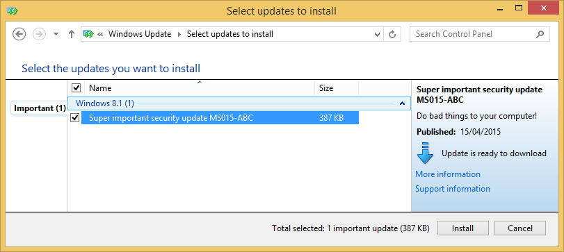

# WSUSpect Proxy

This is a proof of concept script to inject 'fake' updates into non-SSL WSUS traffic.
It is based on our BlackHat USA 2015 presentation, 'WSUSpect – Compromising the Windows Enterprise via Windows Update'

- White paper: http://www.contextis.com/documents/161/CTX_WSUSpect_White_Paper.pdf
- Slides: TODO

## Prerequisites
You'll need the Python Twisted library installed. You can do this by running:
```
pip install twisted
```

You also need to place a Microsoft-signed binary (e.g. [PsExec](https://technet.microsoft.com/en-gb/sysinternals/bb897553.aspx)) into the payloads directory. 
This script has been tested on Python 2.7 on Linux. It does not yet work with Python 3.x; contributions are welcome.
 
## Usage
To test this out, you'll need a target Windows 7 or 8 machine that is configured to receive updates 
from a WSUS server over unencrypted HTTP. The machine should be configured to proxy through the 
machine running this script. This can be done by manually changing the proxy settings or via other
means such as WPAD poisoning (e.g. using [Responder](https://github.com/SpiderLabs/Responder))
```
python wsuspect_proxy.py payload_name [port]
```
An example payload for PsExec is set up that will launch cmd.exe running as Administrator:
```
python wsuspect_proxy.py psexec
```

If you are having problems getting the script to work we'd recommend using a GUI proxy tool
such as Burp (and configuring Burp to use this script as a proxy) to see if the update XML 
is being correctly inserted.

## Customisation

Modify payloads/payloads.ini to change the payloads and their arguments.

## Known Issues

- Currently doesn't support Windows 10, though it should be simple matter of adding the correct GUID to the XML templates
- Doesn't yet support Python 3

## Screenshots

